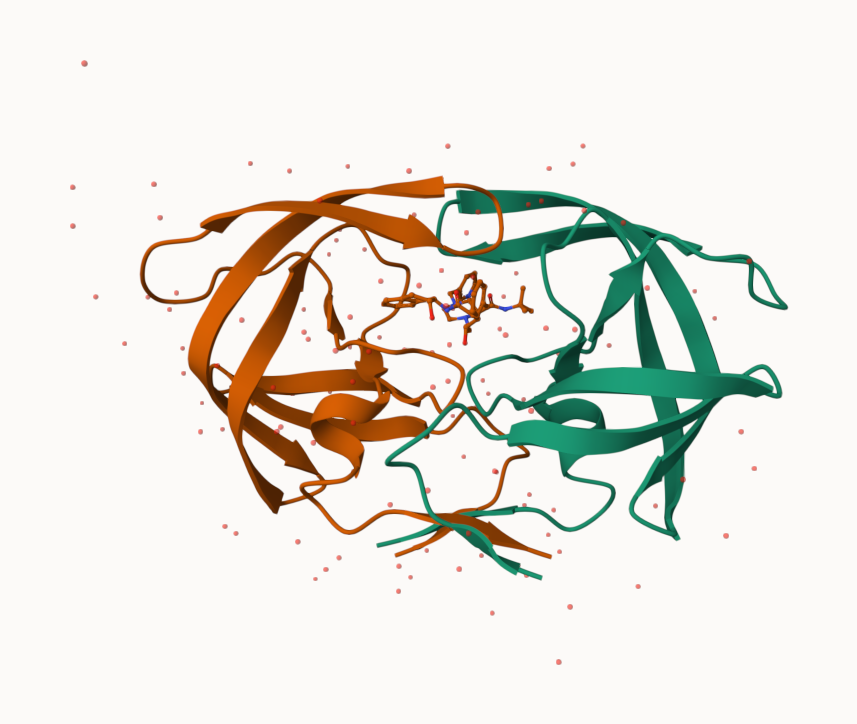
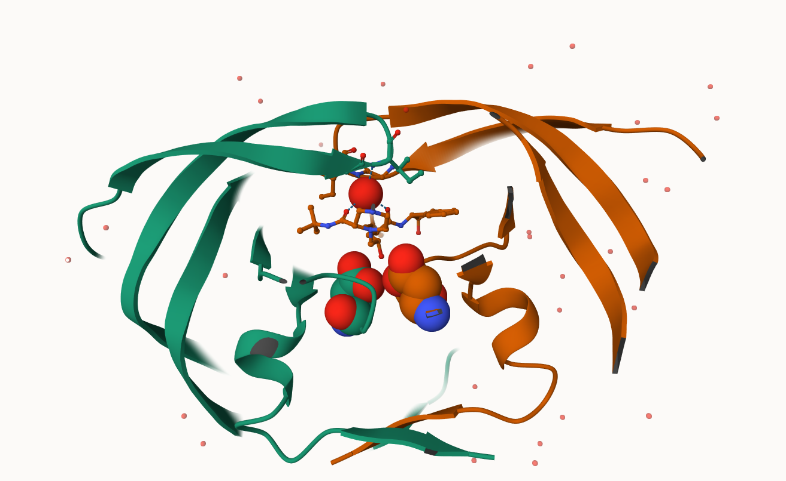

## Background

The main repository of high-resolution structural data on biomolecules is called the **Protein Data Bank** (PDB).

## PDB statistics

What is in the PDB in terms of molecule type and structure determination method?

Read a CSV file of current PDB stats obtained from https://www.rcsb.org/stats/summary

```{r}
pdb <- read.csv("Data Export Summary.csv")
pdb
```

> **Q1.** What percentage of structures in the PDB are solved by X-Ray and Electron Microscopy.

```{r}
pdb$X.ray
```

This print out above `pdb$X.ray` is "character" not "numeric". Therefore I can't do math with it. We need to fix this...

The two functions that help here are `sub()` and `as.numeric`

```{r}
# We want to get rid (or sub out) commas:
x <- pdb$X.ray
tmp <- sub(",", "" , x)
sum( as.numeric(tmp))
```

We could make a function to do this:

```{r}
rm.comma <- function(x) {
  tmp <- sub(",", "" , x)
  sum( as.numeric(tmp))
}
```

```{r}
n.total <- rm.comma (pdb$Total)
n.xray <- rm.comma(pdb$X.ray)
n.em <- rm.comma(pdb$EM)

n.xray/n.total * 100
n.em/n.total * 100
```
~80.5% of PDB structures are solved by X-ray crystallography and ~13.4% are solved by Electron Microscopy.

We could also use a different import function for this CSV that speaks American (i.e. deals with commas in numbers in a comma separated value file)

```{r}
library(readr)

pdb <- read_csv("Data Export Summary.csv")
```

```{r}
n.tot <- sum(pdb$Total)
n.xray <- sum(pdb$`X.ray`)
n.em <- sum(pdb$EM)

n.xray/n.tot * 100
n.em/n.tot * 100
```

> **Q.** How many total protein structures are there in the data set?

```{r}
pdb$Total[1]
```

The total number of protein sequences in the dataset is 202,556,314.

```{r}
217375/202556314 * 100
```

> **Key-point**: We have a very, very small structural coverage of known proteins (~0.1%). Most structures we know about (~80%) come from one method (X-ray crystalography).

> **Q2.** What proportion of structures in the PDB are protein?

```{r}
pdb[, 2:ncol(pdb)] <- lapply(pdb[, 2:ncol(pdb)], function(x) {
  as.numeric(gsub(",", "", x))
})

n.tot <- sum(pdb[, 2:ncol(pdb)], na.rm = TRUE)

protein <- sum(
  pdb[pdb$`Molecular Type` == "Protein (only)", 2:ncol(pdb)],
  na.rm = TRUE
)

protein / n.tot * 100
```
There are ~85.8% of structures  in the PDB that are protein only structures.

> **Q3.** Type HIV in the PDB website search box on the home page and determine how many HIV-1 protease structures are in the current PDB?

There are 1,227 HIV-1 protease structures in the current PDB.

## Visualizing the HIV-1 protease structure

Main stand alone web verstion with all features is at https://molstar.org/viewer/.




> **Q4.** Water molecules normally have 3 atoms. Why do we see just one atom per water molecule in this structure?

There is only one atom per water molecule because the X-ray structures show only the oxygen atom of water. The hydrogen atoms are quite small and scatter the X-rays less so they are not that visible in the PDB structures.

> **Q5.** There is a critical “conserved” water molecule in the binding site. Can you identify this water molecule? What residue number does this water molecule have?

The critical "conserved" water molecule in the binding site is the water that connects the inibitor and the residues flapping (specifically HOH 301). 

Now you should be able to produce an image similar or even superior to Figure 2 and save it to an image file.

> **Q6.** Generate and save a figure clearly showing the two distinct chains of HIV-protease along with the ligand. You might also consider showing the catalytic residues ASP 25 in each chain and the critical water (we recommend “Ball & Stick” for these side-chains). Add this figure to your Quarto document.



Discussion Topic: Can you think of a way in which indinavir, or even larger ligands and substrates, could enter the binding site?
Large ligands and substrates could enter the binding site through the flexible flap regions where they can open and close allowing the ligand and substrates in before closing.

# Getting started with the Bio3D package

Bio3D is an R package from CRAN for structural bioinformatics

```{r}
library(bio3d)

pdb <- read.pdb("1hsg")
pdb
```

```{r}
head(pdb$atom)
```

There are lots of functions that can work with these `pdb` objects

```{r}
head( pdbseq( pdb ) )
```

> **Q7.** How many amino acid residues are there in this pdb object? 

There are 198 residues.

> **Q8.** Name one of the two non-protein residues? 

One of the non-protein residues is HOH (127). The other one is MK1 (1).

> **Q9.** How many protein chains are in this structure?

There are 2 protein chains: chain A and B.

We can have a quick interactive view of any of these `pdb` objects:

```{r}
library(bio3dview)

# view.pdb(pdb)
```

Let's try a custom view
```{r}
#view.pdb(pdb, colorScheme="sse")
```

> **Q.** Create a custom view highlighting the active site ASP (`resno=25`), the two chains (in your choice of colors) and the ligand all on a custom color background

```{r}
library(NGLVieweR)

active.site <- atom.select(pdb,resno=25)

#view.pdb(pdb,
         #cols = c("red","blue"),
         #highlight = active.site, 
         #highlight.style = "spacefill", 
         #backgroundColor= "pink") |>
  #setRock()
```

## Predict the flexibility of a given structure

Let's do a Normal Mode Analysis (NMA) to predct the flexibility of a give `pdb` object: 

```{r}
adk <- read.pdb("6s36")
```

A quick structure summary

```{r}
adk
```

```{r}
m <- nma( adk )
plot(m)
```
View the results
```{r}
#view.nma(m)
```

Write out the results for viewing in Mol-star:
```{r}
mktrj(m, file="nma.pdb")
```

## Comparatve analysis of the ADK family

> **Q10.** Which of the packages above is found only on BioConductor and not CRAN? 

`msa` is the package only found in Bioconductor not CRAN.

> **Q11.** Which of the above packages is not found on BioConductor or CRAN?

Bio3Dview is the package not found in Bioconductor nor CRAN because it's installed straight from GitHub.

> **Q12.** True or False? Functions from the pak package can be used to install packages from GitHub and BitBucket?

True.

Our first step is find a sequence for this family. We will use the database ID "1ake_A" here:

```{r}
library(bio3d)
id <- "1ake_A"

aa <- get.seq(id)
aa
```

> **Q13.** How many amino acids are in this sequence, i.e. how long is this sequence? 

There are 214 amino acids in the sequence

Search for related sequences
```{r}
blast <- blast.pdb(aa)
```

```{r}
head( blast$hit.tbl)
```

```{r}
hits <- plot(blast)
```

```{r}
hits$pdb.id
```

```{r}
files <- get.pdb(hits$pdb.id, path="pdbs", split=TRUE, gzip=TRUE)
```

Align and superpose all these ADK structures

```{r}
pdbs <- pdbaln(files, fit = TRUE, exefile="msa")
```

```{r}
pdbs
```

Quick interactive structural view

```{r}
#view.pdbs(pdbs)
```

PCA of all this structural data (x, y, and z atom coordinates):

```{r}
pc <- pca(pdbs)
plot(pc)
```

```{r}
plot(pc, 1:2)
```

Interactive view of the PC1 captured structural differences:

```{r}
#view.pca(pc)
```

```{r}
mktrj(pc, file="pca.pdb")
```
